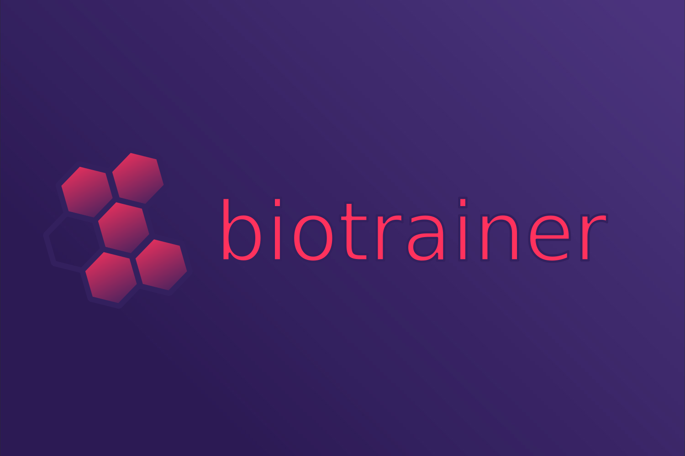

# Biotrainer

[](https://github.com/sacdallago/biotrainer/blob/main/LICENSE)
[](https://biocentral.cloud/docs/biotrainer/config_file_options)
[](https://github.com/sacdallago/biotrainer/releases)

<p align="center">
  
<br />
Biological prediction models made simple. 
</p>

## Overview
*Biotrainer* is an open-source framework that simplifies machine learning model development for protein analysis. 
It provides:
- **Easy-to-use** training and inference pipelines for protein feature prediction
- **Standardized data formats** for various prediction tasks
- **Built-in support** for protein language models and embeddings
- **Flexible configuration** through simple YAML files

## Quick Start

### 1. Installation

Install using pip:
```shell
pip install biotrainer
```

Manual installation using [uv](https://github.com/astral-sh/uv):
```shell
# First, install uv if you haven't already:
pip install uv

# Create and activate a virtual environment
uv venv
source .venv/bin/activate  # On Unix/macOS
# OR
.venv\Scripts\activate  # On Windows

# Basic installation
uv pip install -e .

# Installing with jupyter notebook support:
uv pip install -e ".[jupyter]"

# Installing with onnxruntime support (for onnx embedders and inference):
uv pip install -e ".[onnx-cpu]"    # CPU version
uv pip install -e ".[onnx-gpu]"    # CUDA version
uv pip install -e ".[onnx-mac]"    # CoreML version (for Apple Silicon)

# You can also combine extras:
uv pip install -e ".[jupyter,onnx-cpu]"

# For Windows users with CUDA support:
# Visit https://pytorch.org/get-started/locally/ and follow GPU-specific installation, e.g.:
pip3 install torch torchvision torchaudio --index-url https://download.pytorch.org/whl/cu118
```

### 2. Basic Usage
```shell
# Training
biotrainer train --config examples/sequence_to_class/config.yml

# Inference
python3
>>> from biotrainer.inference import Inferencer
>>> inferencer, _ = Inferencer.create_from_out_file('output/out.yml')
>>> predictions = inferencer.from_embeddings(your_embeddings)
```

### 3. Quick Start Datasets
- **Subcellular Localization Prediction**
  - *Protocol*: `sequence_to_class`/`residues_to_class`
  - [Citations and Download](https://github.com/Rostlab/pbc/tree/main/supervised/scl)
- **Secondary Structure Prediction** 
  - *Protocol*: `residue_to_class`
  - [Citations and Download](https://github.com/Rostlab/pbc/tree/main/supervised/secondary_structure)


## Features

### Supported Prediction Tasks
- **Residue-level classification** (`residue_to_class`)
- **Residue-level regression** (`residue_to_value`) *[BETA]*
- **Sequence-level classification** (`sequence_to_class`)
- **Sequence-level regression** (`sequence_to_value`)
- **Residues-level classification** (`residues_to_class`, like sequence_to_class with per-residue embeddings)
- **Residues-level regression** (`residues_to_value`, like sequence_to_value with per-residue embeddings)

### Built-in Capabilities
- Multiple embedding methods (ProtT5, ESM-2, ONNX, etc.)
- Various neural network architectures
- Cross-validation and model evaluation
- Performance metrics and visualization
- Sanity checks and automatic calculation of baselines (such as random, mean...)
- Docker support for reproducible environments

## Documentation

### Tutorials
- [First Steps Guide](docs/first_steps.md)
- [Interactive Tutorials](examples/tutorials)
- [Config Options Overview](docs/config_file_options_overview.md)
- [Biocentral Web Interface](https://biocentral.cloud/app)

### Detailed Guides
- [Data Standards](docs/data_standardization.md)
- [Configuration Options](docs/config_file_options.md)
- [Troubleshooting](docs/troubleshooting.md)

## Example Configuration
```yaml
protocol: residue_to_class
input_file: input.fasta
model_choice: CNN
optimizer_choice: adam
learning_rate: 1e-3
loss_choice: cross_entropy_loss
use_class_weights: True
num_epochs: 200
batch_size: 128
embedder_name: Rostlab/prot_t5_xl_uniref50
```

## Docker Support
```shell
# Run using pre-built image
docker run --gpus all --rm \
    -v "$(pwd)/examples/docker":/mnt \
    -u $(id -u ${USER}):$(id -g ${USER}) \
    ghcr.io/sacdallago/biotrainer:latest /mnt/config.yml
```

More information on running docker with gpus: 
[Nvidia container toolkit](https://docs.nvidia.com/datacenter/cloud-native/container-toolkit/latest/install-guide.html)

## Getting Help
- Check our [Troubleshooting Guide](docs/troubleshooting.md)
- [Create an issue](https://github.com/sacdallago/biotrainer/issues/new)
- Visit [biocentral.cloud](https://biocentral.cloud/docs/biotrainer/config_file_options)

## Citation
```bibtex
@inproceedings{
sanchez2022standards,
title={Standards, tooling and benchmarks to probe representation learning on proteins},
author={Joaquin Gomez Sanchez and Sebastian Franz and Michael Heinzinger and Burkhard Rost and Christian Dallago},
booktitle={NeurIPS 2022 Workshop on Learning Meaningful Representations of Life},
year={2022},
url={https://openreview.net/forum?id=adODyN-eeJ8}
}
```