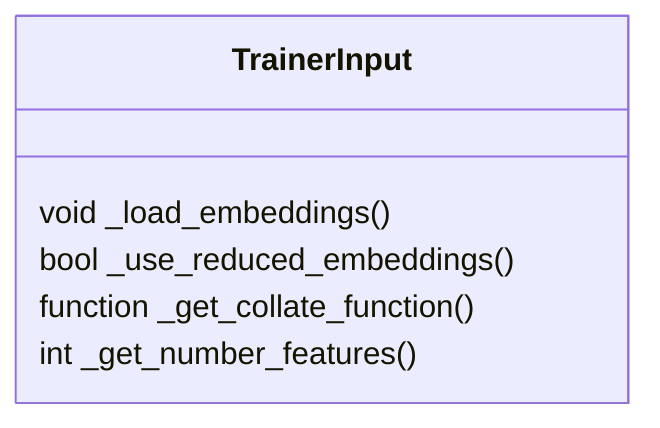
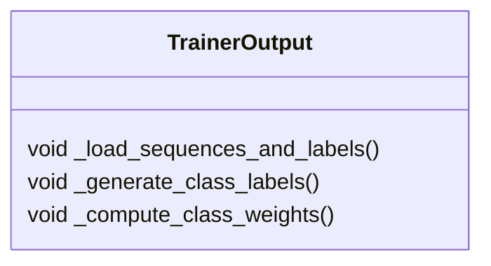
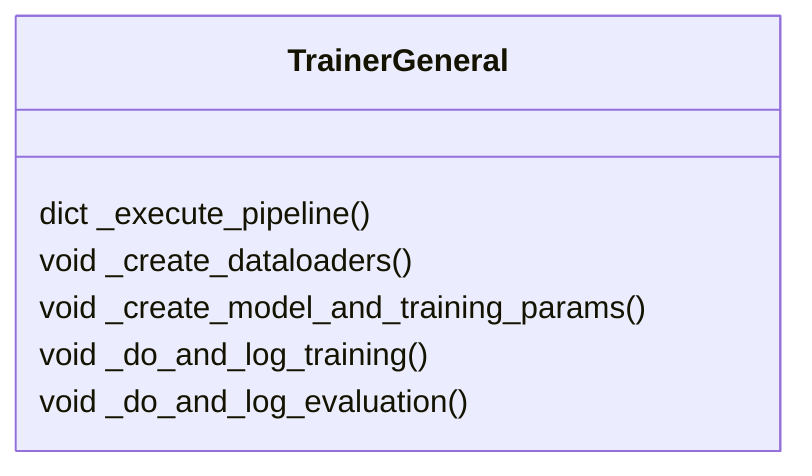

# Architectural decision record 002 - Trainer Module

In this document we will give an overview about the decision process behind the implementation of the `trainers` module.

## Input/Output distinction

Depending on the protocol we have 3 different possibilities for the input:
1. Residue (Dim: Length of protein x Size of embedding vector)
2. Residues (Dim: Length of protein x Size of embedding vector)
3. Sequence (Dim: 1 x Size of embedding vector)

1 and 2 actually do not differ in the input shape or kind directly, but it has to be handled different by the models.

List of functions related to the kind of input in the trainer class:

Depending on the protocol we have also 2 different possibilities for the output:
1. Class (Multinomial or binary prediction)
2. Value (Floating point value)

Both of them can be predicted either for a whole sequence or for every residue.
List of functions related to the kind of output in the trainer class:

There are also some functions that won't change, regardless of the kind of input and output:

### Decision/Solution:
Trainer class is split up in 3 parts:
* embeddings.py that only handles loading of the embeddings
* TargetManager that creates torch datasets from the input files and embeddings and handles class_weight calculation
* The trainer itself that handles the general aspects of training and uses the functionalities from the scripts above.
It was eventually kept to be a function rather than a class, to simplify readability of the pipeline. Only very
time-consuming functions, i.e. `_do_and_log_training()` and `_do_and_log_evaluation()` have been separated to individual
functions. The functionality described in the TrainerGeneral class above is of course kept, but executed consecutively
in the `training_and_evaluation_routine()`.

