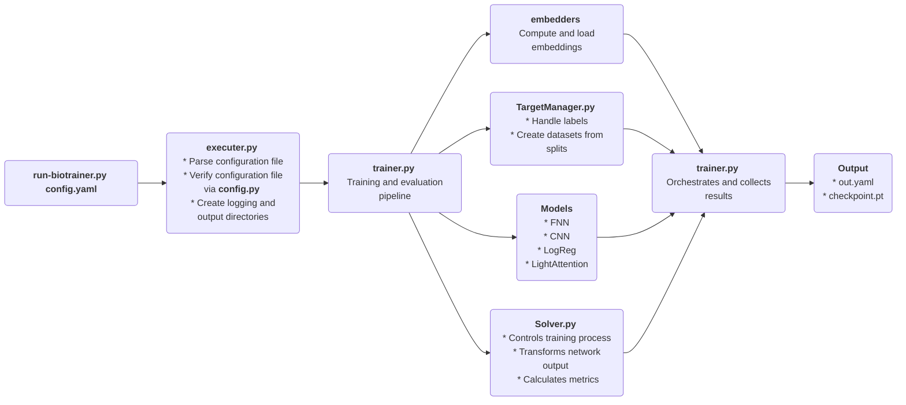

# Architecture Overview of Biotrainer

The aim of this document is to provide the interested reader with a quick overview of the architecture 
of **biotrainer**. Knowledge about the architecture is not essential for using the tool. However, if custom changes
to the training process, models or pipeline become necessary, this overview hopefully helps where to get started.
Note that to achieve this, only the most important aspects of the individual components are described here. 

The architecture can be generally summarized by the following diagram:

The single parts are now described in more detail:
* **run-biotrainer.py config.yaml**: The script to execute biotrainer. A valid configuration file must
be provided in *yaml* format.
* **executer.py**: This script parses the configuration file to a dictionary. After that, it checks if the configuration
is valid, i.e. it includes all necessary input file paths, and it does not include any mutually exclusive options.
* **trainer.py**: The central part of the biotrainer pipeline. It contains the very long 
`training_and_evaluation_routine` function, which orchestrates all further parts. It was intentionally decided not to
split it in multiple functions, besides two small exceptions, mainly for readability reasons. More information can be
found [here](adrs/ADR002_trainer_module.md).
* **embedders**: The first part of the pipeline. If no pre-computed embeddings have been provided, they are now
computed based on the provided input file and the protocol. Once embeddings exist, they are loaded and mapped to
a dictionary (`id2emb`) in the trainer routine. Hence, the `id2emb` dictionary maps the sequence id 
from the sequence file to the associated embedding. 
* **TargetManager.py**: Based on the protocol, datasets with different inputs and labels have to be constructed.
The TargetManager class at first loads the respective labels either from a separate labels file 
(currently only for *residue_to_class* protocol, might also include a *mask* file), 
or from the *TARGET=* annotation in the sequence file. After that, the previously calculated embeddings and the labels
are used to construct the datasets for training, validation and testing. Note that these splits are not calculated
in the TargetManager, but must be declared in the respective annotations either of the sequence or the label file.
A reason why there is no functionality to create data set splits automatically (yet), is given by the fact that creating
data set splits for biological data is non-trivial. Besides some exceptions, random splits will not be sufficient or
misleading, that is why automatic splitting might do more harm than good at the moment.
* **Models**: The next step in the pipeline is to load the model with the chosen architecture. Model parameters,
including the optimizer and the loss function, are applied accordingly.
* **Solver**: The final major module of the pipeline. Inheritance and polymorphism are applied to abstract functions
that apply to all prediction tasks. Protocol-specific functionality, i.e. transforming the output of the network and 
metrics calculation is provided by the respective subclasses, such as *ResidueClassificationSolver.py*. To further
eliminate duplicate code, the *ClassificationSolver.py* class is inherited by all classification-specific solvers,
which handles general classification-related metric calculation.
* **Output**: Finally, the trainer script collects all results and generates an *out.yaml* file, which contains all
training and model parameters, as well as test set metrics and, [if configured](config_file_options.md#general-options), 
the respective test set predictions. The best model is saved in pickle (*.pt*) format in the output directory.
The concrete path of the checkpoint is given by *output*/*model_choice*/*embedder_name*/*checkpoint.pt*.